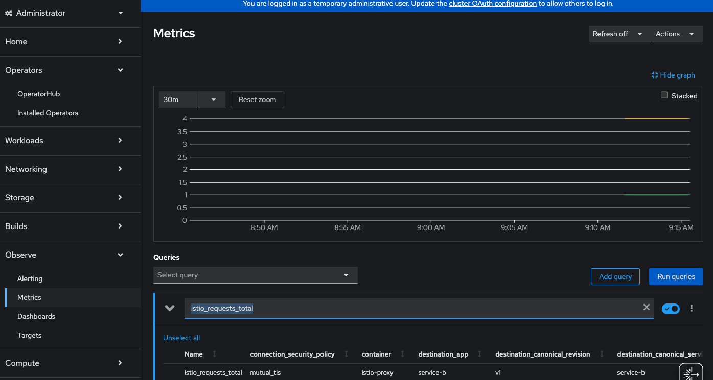
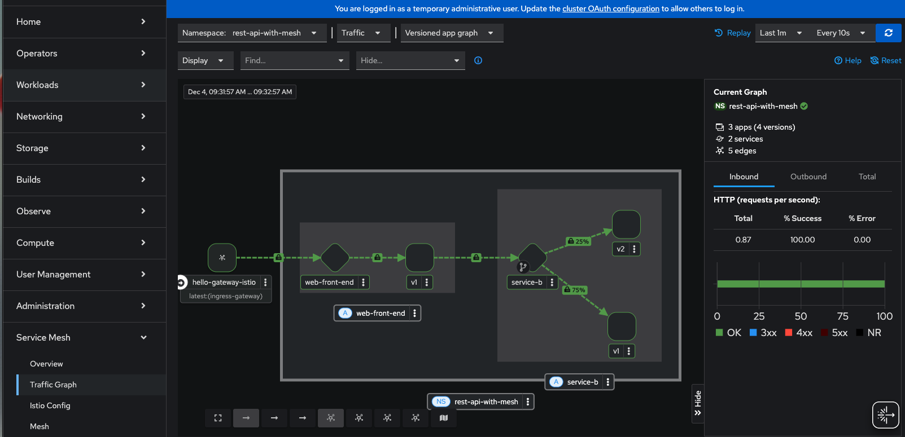

# Service Mesh Demo
Uses `Gateway API` for ingress  

Built for OSSM 3.x (tested on 3.0)

## Installation checklist [TODO]
[X] Gateway API  
[X] OpenShift Service Mesh  
[ ] Kiali  
[ ] Distributed Tracing (Tempo)  
[ ] Cert-Manager  
[ ] Argo Rollouts  

[Current installation documentation](https://docs.openshift.com/service-mesh/3.0.0tp1/install/ossm-installing-openshift-service-mesh.html)

You can use the Red Hat Solution Pattern to get the base OSSM install (along with RHCL), but it might cause more headaches.


[Solution Patterns: Connect, Secure and Protect with Red Hat Connectivity Link](https://www.solutionpatterns.io/soln-pattern-connectivity-link/solution-patter)

## Enable Gateway API
```bash
oc get crd gateways.gateway.networking.k8s.io &> /dev/null ||  { oc kustomize "github.com/kubernetes-sigs/gateway-api/config/crd?ref=v1.0.0" | oc apply -f -; }
```

## Install Infra Operators (Istio, Kiali, Distributed Tracing, Argo)
oc apply -k ./infra

## create Istio components
oc apply -k ./istio

## Create a shared gateway via Gatweway API
oc apply -k ./gateway

## create application
This uses `Kustomize` to deploy the application, including creating the namespace.    
  
oc apply -k ./application/kustomize/overlays/pod  
  
## Test gateway connection to app
`sh ./scripts/test-api.sh `  

```json
{
  "message": "Hello World from web-front-end"
}
{
  "response": {
    "message": "Hello World from service-b-v1"
  }
}
```

## Enable Observability (User Workload Monitoring)
Check whether the cluster-monitoring-config ConfigMap object exists:

```bash
oc -n openshift-monitoring get configmap cluster-monitoring-config
```
  
oc apply -k observability/  
  
Ensure pods are running  
  
`oc -n openshift-user-workload-monitoring get pod`  
  
Expected output example:
```
NAME                                   READY   STATUS    RESTARTS   AGE
prometheus-operator-6cb9d6fbbb-4hnj8   2/2     Running   0          24s
prometheus-user-workload-0             6/6     Running   0          23s
thanos-ruler-user-workload-0           4/4     Running   0          22s
```

You can test to make sure the metrics are available in the `OpenShift Web Console->Observe->Metrics`
and running a query on `istio_requests_total`



## Install Kiali
`oc apply -k kiali`  
  
Ensure `kiali` and ossmconsole `pods` are running (kiali can take 30+ seconds to come online)  
  
oc get pods -n istio-system  
```
NAME                           READY   STATUS    RESTARTS   AGE
istiod-6847b886d5-prbvw        1/1     Running   0          16m
kiali-6998bfc7cb-cfdlh         1/1     Running   0          48s
ossmconsole-579d777bfb-hrjg5   1/1     Running   0          15s
```
Get the route to kiali
```bash
echo "https://$(oc get routes -n istio-system kiali -o jsonpath='{.spec.host}')"
```

You can also view Istio data from the OSSM Console via `OpenShift Web Console->Service Mesh`


## quick and dirty graphana stack (only run if wanted. Not necessary)
kubectl apply -n istio-system -f https://raw.githubusercontent.com/istio/istio/refs/heads/master/samples/addons/grafana.yaml


## Canary deployment
run the scripts:  
`scripts/generate-traffic.sh` - While loop that gets message from backend service via the front-end  
  
`scripts/canary-rollout.sh` - to simulate a canary roll out while traffic is live.  
  
You can see real time updates from the first script during the canary deployment (so have two terminals open for this)

# Ignore everything below this for now
## create traffic pattern
oc apply -f ./TrafficPattern

## Test External Traffic If OpenshiftRoute Disabled for Gateways in Control Plane
curl http://istio-ingressgateway-istio-system.apps.cluster-2z7g7.dynamic.redhatworkshops.io/main-page

## Test with external traffic If OpenshiftRoute Enabled for Gateways in Control Plane
curl http://toolkit-toolkit-gateway-1-684888c0ebb17f37-istio-system.apps.cluster-2z7g7.dynamic.redhatworkshops.io/main-page

## do the same with GatewayInjection
``` 
    oc apply -f ./GatewayInjection/gatewayInjection.yaml
    oc apply -f ./GatewayInjection/traffic-pattern.yaml
```    

## Test with external traffic If OpenshiftRoute Enabled for Gateways in Control Plane
curl http://toolkit.apps.cluster-2z7g7.dynamic.redhatworkshops.io/main-page